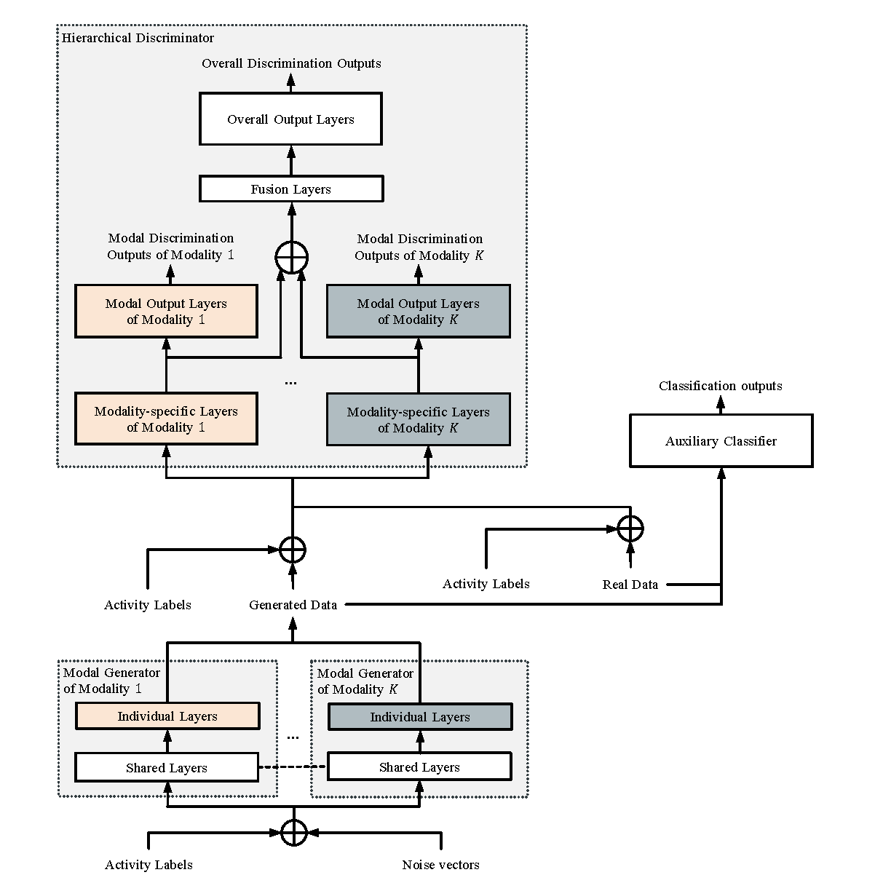

# HMGAN

This is the official repository for our paper: HMGAN: A Hierarchical Multi-Modal Generative Adversarial Network Model for Wearable Human Activity Recognition



## Dependencies

* python 3.8
* torch == 1.10.0 (with suitable CUDA and CuDNN version)
* numpy, torchmetrics, scipy, pandas, argparse, sklearn

## Datasets

| Dataset | Download Link |
| -- | -- |
| UTD-MHAD | https://personal.utdallas.edu/~kehtar/UTD-MHAD.html |
| UCI-HAR | https://archive.ics.uci.edu/ml/datasets/human+activity+recognition+using+smartphones |
| OPPORTUNITY | https://archive.ics.uci.edu/ml/datasets/opportunity+activity+recognition |

## Quick Start

Data preprocessing is included in main.py. Download the datasets and run HMGAN as follows. This gives the performance of each split in 5-fold cross-validation, and their average.
```
python main.py --data_path [/path/to/dataset] --dataset [UTD_MHAD_arm, UCI_HAR, or OPPORTUNITY] 
```
